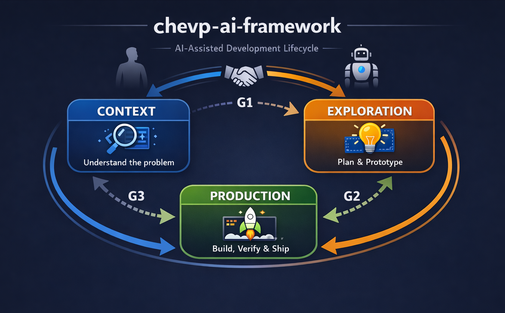

# AI-Assisted Development Lifecycle

> **Scope: The 3-step lifecycle applies to EVERY individual change — not to the product as a whole. Each task (feature, bugfix, refactoring) starts fresh at Context and progresses through Exploration to Production. The lifecycle is independent of the project's SDLC phase.**

## The 3-Step Model

<p align="center">
  
</p>

Each step produces defined artifacts. No step is skipped. The AI enforces the process; the human approves every transition.

---

## Steps × Roles Matrix

|                          | [Context](01-context/)           | [Exploration](02-exploration/)         | [Production](03-production/)             |
|--------------------------|----------------------------------|----------------------------------------|------------------------------------------|
| **SDLC**                 | [sdlc](01-context/sdlc.md)       | [sdlc](02-exploration/sdlc.md)         | [sdlc](03-production/sdlc.md)            |
| **AI-Plans**             | [ai-plans](01-context/ai-plans.md) | [ai-plans](02-exploration/ai-plans.md) | [ai-plans](03-production/ai-plans.md)    |
| **UX-Tooling**           | —                                | [ux-tooling](02-exploration/ux-tooling.md) | [ux-tooling](03-production/ux-tooling.md) |
| **DevOps**               | —                                | —                                      | [devops](03-production/devops.md)        |
| **Software-Architecture**| [arch](01-context/software-architecture.md) | [arch](02-exploration/software-architecture.md) | [arch](03-production/software-architecture.md) |
| **Context-Engineering**  | [ctx](01-context/context-engineering.md) | [ctx](02-exploration/context-engineering.md) | [ctx](03-production/context-engineering.md) |

---

## Role Definitions

| Role | Scope |
|------|-------|
| **SDLC** | Process governance, step transitions, quality gates, iteration rules |
| **AI-Plans** | Plan/spec artifacts, acceptance criteria, scope management |
| **UX-Tooling** | Prototypes, preview feedback loops, visual/physical validation |
| **DevOps** | Build verification, commit workflow, CI/CD, delivery pipeline |
| **Software-Architecture** | Architecture analysis, ADRs, pattern enforcement, design decisions |
| **Context-Engineering** | CLAUDE.md, context hierarchy, what AI must read, context freshness |

---

## AI Modes

The AI owns the process. The human writes naturally; the AI infers the mode, enforces gates, and blocks violations — automatically. No structured prompts, mode declarations, or manual state management required.

AI operates in exactly one mode at a time. The mode determines what AI may and may not do.

| Mode | Intent Signals | Allowed | Not Allowed |
|------|---------------|---------|-------------|
| **Context** | "what does", "explain", "analyze", "understand", new task, ambiguous start | Read/verify artifacts, ask questions, create Context-Plan, produce System Spec | Change code, create feature plans, alter scope |
| **Exploration** | "plan", "design", "prototype", "spec", "how should we" | Create Feature Plan/Spec, write ADRs, iterate prototypes, document risks | Write production code, expand scope unilaterally |
| **Production** | "implement", "build", "code", "execute the plan", "fix" (with approved plan) | Execute approved plan, run tests, verify build, create commits | Create new plans, expand scope, make unplanned changes |

### AI Mode-Detection Protocol

Before every response, the AI determines the current mode through this priority order:

1. **Conversation state** — If a mode is already active and no transition has occurred, stay in that mode
2. **Intent classification** — Classify user intent from natural language using the signal words above
3. **Default to Context** — When intent is ambiguous and no mode is active, start in Context (the safest mode)
4. **Block when conflicting** — If the user's intent requires a later mode but the gate is not passed, the AI blocks the request, explains what prerequisites are missing, and guides the user back to the correct step

The AI **MUST NOT** silently switch modes. Any mode change must be explicitly announced with reasoning. Forward transitions require human approval.

### Mixed-Intent Resolution

When a single message contains signals for multiple modes (e.g., "explain how auth works and then implement the fix"), the AI:

1. **Decomposes** the request into its distinct intents
2. **Sequences** them by lifecycle order — earlier modes first
3. **Executes** the earliest mode's portion and stops at the gate boundary
4. **States** what remains: "I've addressed the Context part. The implementation requires G1 + G2 to be passed first — here's where we stand."

The AI never cherry-picks the later intent and skips the earlier one.

### Adaptive Mode-Awareness Header

The AI outputs a header before every response. The header's detail level adapts to what is useful — not every response needs full gate status.

| Situation | Header Level | Example |
|-----------|-------------|---------|
| Mode change, gate transition, or blocking | **Full** — mode + reasoning, gate progress, next action | `[Context] You're asking about the codebase. G1 not yet passed (missing: System Spec). Let me start there.` |
| Continuing work in the same mode | **Short** — mode confirmation only | `[Production] Continuing implementation.` |
| Blocking a request | **Full + redirect** — why it's blocked, what's missing, how to proceed | `[Blocked → Exploration] No approved plan exists. Let me help you write one.` |

The header is the AI's responsibility — the human never needs to provide or manage it.

### AI Gatekeeper Behavior

The AI acts as an autonomous process enforcer. Before every response, the AI:

1. **Infers** the mode from user intent and conversation history
2. **Checks** whether the current gate prerequisites are met
3. **Blocks** if the user's request belongs to a later mode and the gate is not passed — the AI states the specific missing prerequisites and redirects to the current step
4. **Proposes** forward transitions when all gate criteria are satisfied: "All Context deliverables are ready. G1 is satisfied. Shall we move to Exploration?"
5. **Detects** backward jumps when the conversation shifts (e.g., "actually, the requirements are wrong") and proposes the jump
6. **Guides** — when blocking, the AI does not just say "no" but actively helps the user complete the missing prerequisites

**Examples of blocking:**

- User asks "implement feature X" but no plan exists → AI blocks: "We need a feature plan first. Let me help you create one — what problem does feature X solve?"
- User asks "write the code" but G1 is not passed → AI blocks: "We haven't confirmed the context yet. Here's what's still missing: [lists items]. Let me help with those first."

### Mode Transitions

```
Context ──[G1 passed + Human confirms]──→ Exploration
Exploration ──[G2 passed + Human approves]──→ Production
Production ──[G3 passed + Human approves]──→ Done
```

**Forward transitions**: AI verifies all gate criteria, lists them, proposes the transition, and waits for human approval.

**Backward jumps**: AI detects when the conversation shifts backward (plan is wrong, requirements misunderstood, fundamental problem discovered) and proposes the jump. Human confirms.

**Production → Exploration fallback**: During Production, the AI **must** propose a fallback to Exploration when any of these triggers occur:
- Implementation reveals the plan is incomplete or ambiguous (an unaddressed edge case, a missing step)
- A technical constraint makes the approved approach unviable
- The human requests a change that exceeds the plan's scope

The AI stops implementing, states the specific trigger, and proposes: "This needs a plan update. Shall we fall back to Exploration?" The AI does not silently patch the plan or improvise beyond the approved scope.

**Rule:** Forward only with passed gate + human confirmation. Backward at any time when needed.

### State Tracking

The AI tracks all session state internally — the human never manages state:
- Current mode (Context / Exploration / Production)
- Active plan reference (if any)
- Gate status (G1, G2, G3 — passed or pending with specific missing items)
- Whether the human has approved the current gate

No manual session state block, prompt headers, or mode declarations are required from the human. The AI announces state changes through its mode-awareness header and is solely responsible for maintaining process continuity.

---

## Mandatory Deliverables per Step

| Deliverable | Context | Exploration | Production |
|-------------|---------|-------------|------------|
| Context-Plan (CPLAN) | **Mandatory** | — | — |
| System Spec | **Mandatory** | — | — |
| Software Architecture | **Mandatory** | — | — |
| ADRs (fundamental) | **Mandatory** | — | — |
| Context Inventory | **Mandatory** | — | — |
| Scope Confirmation | **Mandatory** | — | — |
| Feature Plan/Spec | — | **Mandatory** | — |
| ADRs (new decisions) | — | As needed | — |
| UX Prototype | — | **Mandatory** (where applicable) | — |
| Production-Plan (PPLAN) | — | — | **Mandatory** |
| Production Code | — | — | **Mandatory** |
| Validation Result | — | — | **Mandatory** |

---

## Quality Gates

| Transition | Gate | Key Criteria |
|------------|------|--------------|
| Context → Exploration | **G1** | Context-Plan confirmed, System Spec exists, Architecture documented, fundamental ADRs written, existing artifacts catalogued, scope confirmed by human, mode transition approved |
| Exploration → Production | **G2** | Feature plan/spec approved, prototype visually confirmed (where applicable), acceptance criteria defined, human approved |
| Production → Done | **G3** | Production-Plan approved before implementation, all acceptance criteria fulfilled, build passes, no regressions, documentation updated, human approved |

**Gates are blockers.** No forward movement until every criterion is satisfied. The human must explicitly approve each gate transition.

Details in each step's [README.md](01-context/README.md).

---

## When Steps May Be Abbreviated

| Scenario | Allowed |
|----------|---------|
| Small bugfix (< 10 lines) | CPLAN and PLAN can be verbal, PPLAN one-liner ("Implements PLAN-NNN"), UX-Tooling omitted. Context deliverables must still be **read and verified**. |
| Purely technical refactoring | UX-Tooling omitted in Exploration and Production |
| Visual feature (UI, shader) | No step is skippable, all plans must be written |
| Architecture decision | UX-Tooling omitted, but ADR is mandatory |
| Exploration / spike | Only Context + Exploration, no Production code |

Even when abbreviated: **no step is skipped entirely**, and **human approval is always required**.

---

## Iteration

The lifecycle is not strictly linear. Backward jumps are allowed:

- **Production → Exploration**: Plan needs adjustment
- **Production → Context**: New insights change the scope
- **Exploration → Context**: Discovery reveals misunderstood requirements

But: **Forward only with a passed quality gate.** No jump from Context to Production.