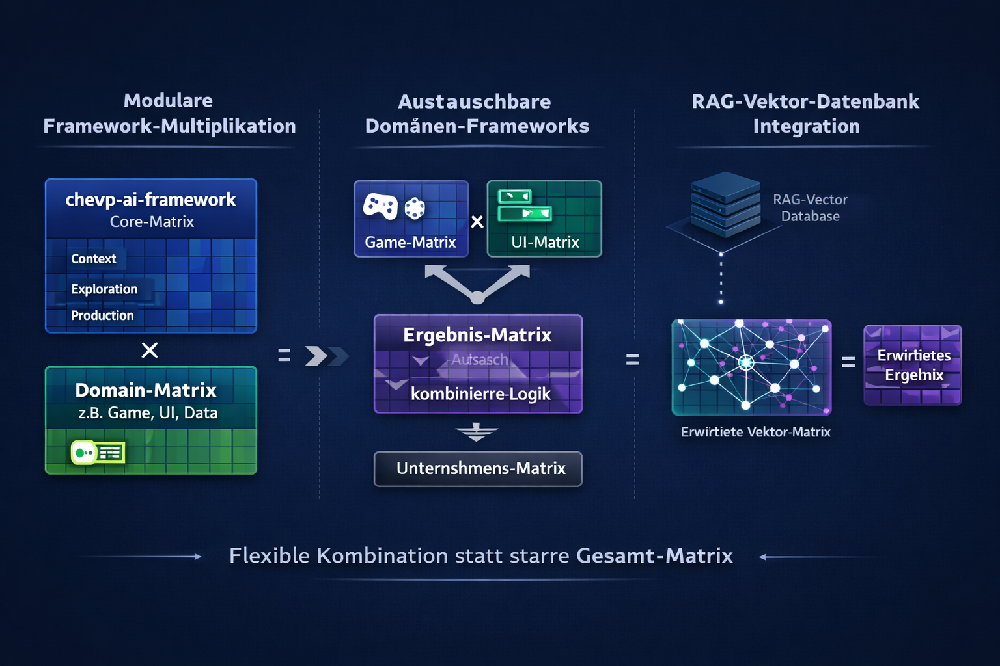
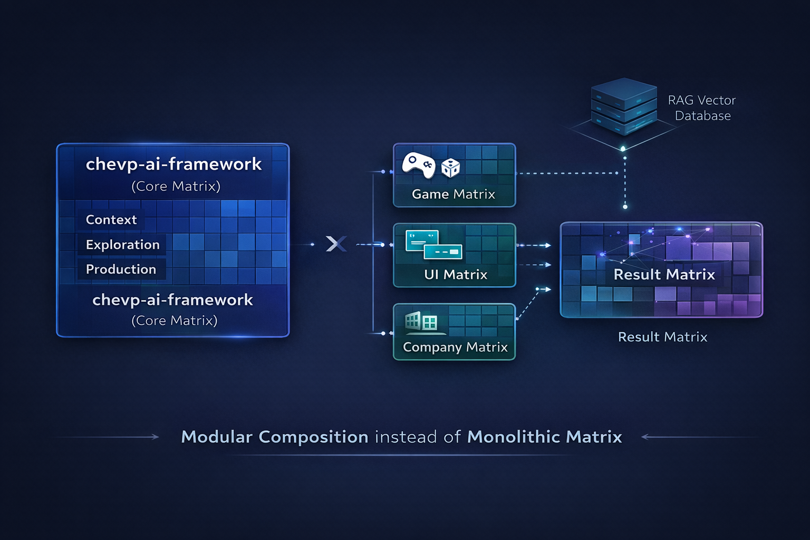

# Modular Composition Approach

<p align="center">
  
</p>

## Why Separate Domains and a Shared Core?

The various AI frameworks in this ecosystem can be thought of as **composable layers**, each representing a clearly bounded transformation logic. The "matrix" metaphor serves as a useful mental model — not as a literal linear algebra operation, but as an intuition for how independent layers combine to produce richer outcomes. Rather than building one monolithic framework that tries to cover everything, the architecture follows a principle of **modular composition**.

## The Core Matrix

The **chevp-ai-framework** serves as the **stable base layer**. It defines the fundamental guardrails, structures, and thinking processes — **Context, Exploration, Production** — independent of any specific domain. This base layer is domain-agnostic by design: it captures *how* AI-assisted development should proceed, not *what* is being built.

## Domain Matrices

<p align="center">
  
</p>

Specific domain frameworks — for example targeting games, UI, or enterprise-specific knowledge — act as **additional layers** that are composed with the base to produce contextually enriched results.

```
Result = Core Framework ⊕ Domain Framework
```

Each domain layer encodes the specialized vocabulary, constraints, patterns, and quality criteria relevant to its field, while relying on the core layer for process structure and lifecycle governance. In practice, this composition works through **context injection**: the domain framework's instructions, prompts, and constraints are layered on top of the core, shaping the AI's behavior without altering the base process.

## The Key Advantage: Composability

The decisive benefit of this modular layering lies in the **interchangeability of individual domain layers**:

- **No monolith** — Instead of forming one large, inseparable system, domains remain independent modules.
- **Flexible composition** — Domains can be added, replaced, or evolved in isolation without affecting the core or other domains.
- **Parallel development** — Teams can work on different domain layers concurrently, all anchored to the same stable base.
- **Selective activation** — Only the domains relevant to a given project need to be injected, keeping context lean and focused.

## Extended Composition with External Knowledge

When external knowledge is integrated — for instance via **RAG-based vector databases** — this corresponds to a dynamic context injection that unlocks additional dimensions:

```
Result = Core Framework ⊕ Domain Framework ⊕ External Knowledge (RAG)
```

This extension comes with **higher complexity and token costs**, but enables the system to incorporate real-time or proprietary data that no static framework could contain. The RAG layer does not modify the core or domain layers — it enriches the available context at query time, keeping the static layers clean and deterministic.

## Summary

The result is a system that remains **structured, extensible, and domain-agnostic at its core** — while being able to absorb arbitrarily specific domain knowledge through composition rather than modification.

| Layer | Role | Stability |
|-------|------|-----------|
| Core Framework | Process, lifecycle, guardrails | High — rarely changes |
| Domain Frameworks | Domain-specific patterns and constraints | Medium — evolves with the domain |
| External Knowledge (RAG) | Real-time or proprietary context | Dynamic — changes continuously |
