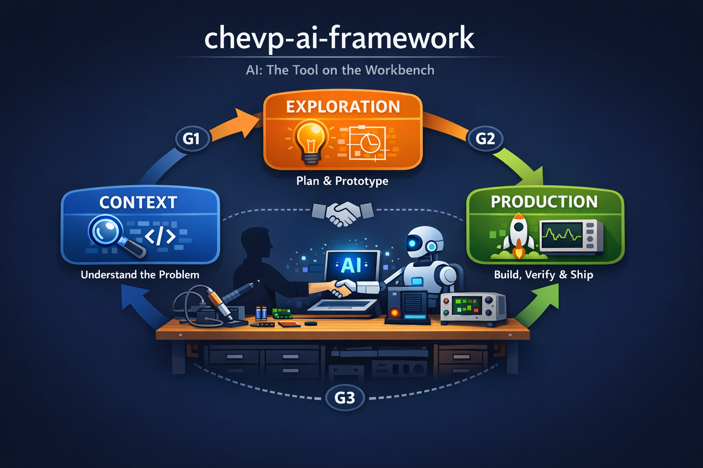
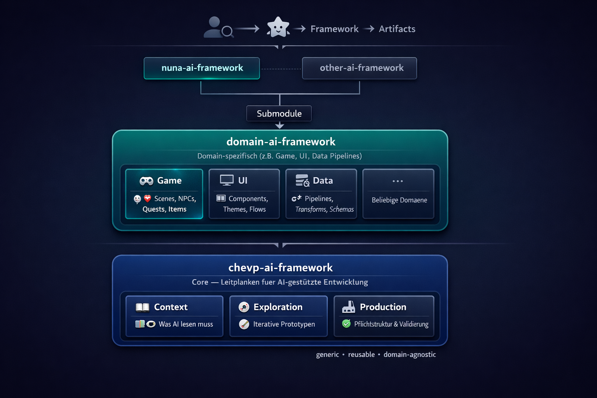

# chevp-ai-framework

**A structured lifecycle for AI-assisted software development.**

> Vibe Coding is not progress — it's technical recklessness.
> AI writes code, but it doesn't take responsibility. This framework does.

---

## Lifecycle

<p align="center">
  
</p>
 
<table>
  <tr>
    <th>Step</th>
    <th>Purpose</th>
    <th>Mandatory Deliverables</th>
  </tr>
  <tr>
    <td><strong><a href="01-context/">Context</a></strong></td>
    <td>Understand the system and problem, produce foundational artifacts</td>
    <td>System Spec, Architecture, ADRs, Context Inventory, Scope Confirmation</td>
  </tr>
  <tr>
    <td><strong><a href="02-exploration/">Exploration</a></strong></td>
    <td>Plan features, prototype, validate the approach</td>
    <td>Feature Plan/Spec, UX Prototype (where applicable)</td>
  </tr>
  <tr>
    <td><strong><a href="03-production/">Production</a></strong></td>
    <td>Build, verify, ship</td>
    <td>Production code, validation result, updated documentation</td>
  </tr>
</table>

Quality gates **G1**, **G2**, **G3** enforce human approval at every transition. Gates are **blockers** — all criteria must be satisfied before forward movement. See [LIFECYCLE.md](LIFECYCLE.md) for the full matrix.

---

## Roles

Six cross-cutting roles operate within each step:

| Role | Scope |
|:-----|:------|
| **SDLC** | Process governance, quality gates, step transitions |
| **AI-Plans** | Plan/spec artifacts, acceptance criteria, scope management |
| **UX-Tooling** | Prototypes, preview feedback loops, visual/physical validation |
| **DevOps** | Build verification, commit workflow, CI/CD |
| **Software-Architecture** | ADRs, pattern enforcement, design decisions |
| **Context-Engineering** | CLAUDE.md, context hierarchy, what AI must read |

---

## Quick Start

Add this block to your project's `CLAUDE.md`:

```markdown
## STOP — Before Any Change

DO NOT create, edit, or delete any file before:
1. The chevp-ai-framework has been loaded:
   @url https://chevp.github.io/chevp-ai-framework/chevp-ai-framework.md
2. The current phase-step (Context / Exploration / Production) is confirmed with the human
```

Then create the context directory structure:

```bash
mkdir -p context/{architecture,adr,guidelines,plans/finished,specs}
```

That's it. Claude loads the framework automatically via `@url` and enforces the lifecycle. See [integration/](integration/) for details.

---

## Repository Structure

```
01-context/       Step 1 — Understand the system and problem
02-exploration/   Step 2 — Plan features and prototype
03-production/    Step 3 — Build, verify, ship
templates/        Plan, spec, ADR, CLAUDE.md, prototype templates
guidelines/       Cross-cutting quality rules
integration/      Integration into existing projects
docs/             Machine-readable AI reference
```

---

## Domain Extension

The chevp-ai-framework is designed as a **generic, reusable, domain-agnostic** core. For domain-specific projects, it can be extended through a **domain-ai-framework** layer.

<p align="center">
  
</p>

The architecture follows a layered approach:

- **chevp-ai-framework** (bottom layer) — The core lifecycle with Context, Exploration, and Production. Generic and reusable across all domains.
- **domain-ai-framework** (middle layer) — A domain-specific extension that adds specialized rules, templates, and conventions for a particular field (e.g., Game, UI, Data Pipelines, or any custom domain).
- **Project frameworks** (top layer) — Concrete project frameworks (e.g., `nuna-ai-framework`) that inherit from the domain layer and produce the final artifacts for human and AI collaboration.

This layered model ensures that domain-specific knowledge (scenes, NPCs, components, pipelines, schemas) lives in the right place — separate from the universal process rules, but built on top of them.

Projects can **tighten** framework rules but never **loosen** them.

---

## Principles

| Principle | Why |
|:----------|:----|
| **Prototype ≠ Production** | Quickly generated code must be reviewed and understood |
| **Context is mandatory** | AI without context invents things |
| **Incremental** | Small steps with validation after each step |
| **Human decides** | AI suggests, the developer bears responsibility |
| **Gates are blockers** | No forward movement without all criteria satisfied |

---

## License

This project is licensed under the [MIT License](LICENSE).